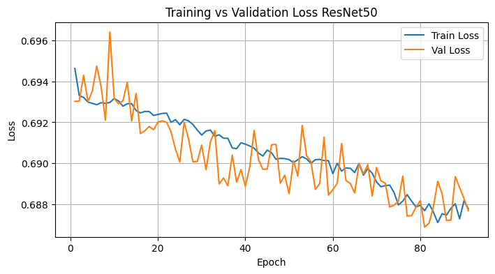
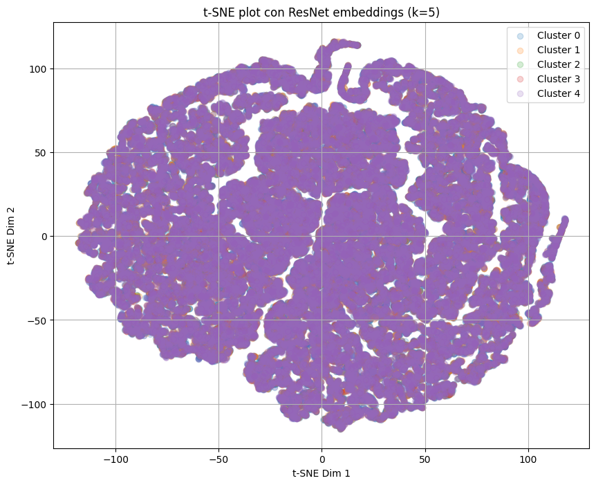
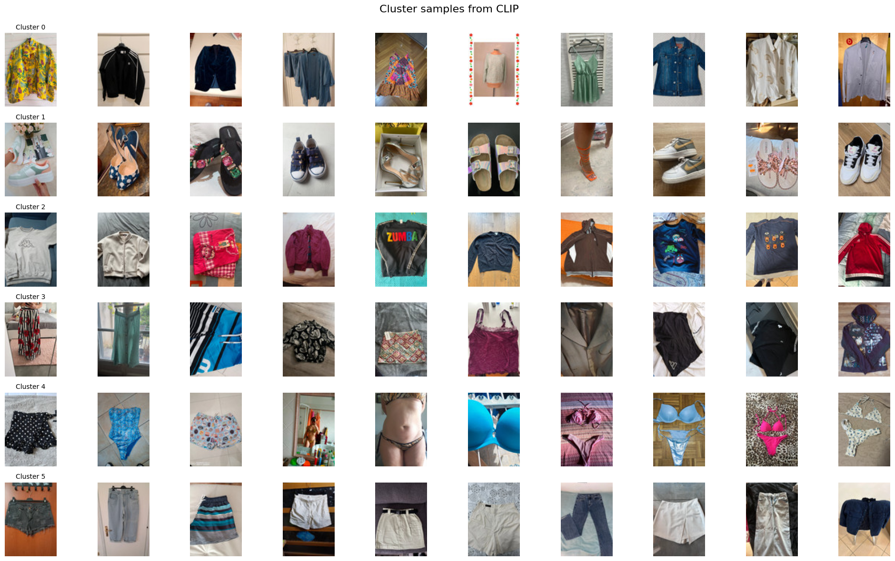
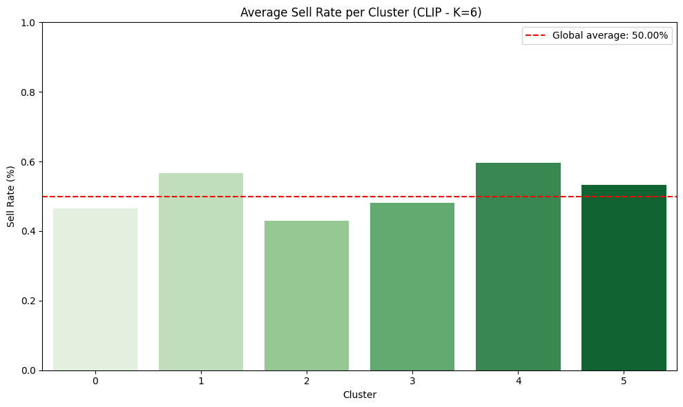

# Image Analysis

## Dataset Overview

This project is based on a large-scale dataset of over 500,000 clothing items scraped from Vinted over a two-month period (April to June). For the purpose of image-based classification, we extracted a balanced subset focused on the sold / not sold target variable.

The balanced dataset used in our classification task consisted of:

- 50,000 images for training
- 12,500 images for validation

The balance between sold and unsold items was maintained to reduce bias and ensure fair training conditions.

## Objective

The goal of this stage was to investigate whether an image alone can predict the likelihood of an item being sold. We approached this by fine-tuning a convolutional neural network (CNN), specifically a ResNet50 model pretrained on ImageNet, adapted to our binary classification task.

## Model and Methodology

We modified the last fully connected layer of the ResNet50 architecture to output a single value for binary classification. The model was trained using binary cross-entropy with logits, and the Adam optimizer was used with a small weight decay for regularization.

Images were preprocessed and augmented with transformations including resizing to 96x96 pixels, random horizontal flipping, rotation, and color jittering. These augmentations helped introduce variability in the training set to avoid overfitting.
All images were normalized using ImageNet statistics.

Training was performed over a maximum of 100 epochs, with early stopping triggered if no improvement was seen in validation loss over 10 epochs.

## Performance and Results

The model failed to produce accurate or generalizable results.

Evaluation on the validation set yielded the following metrics:

| Metric           | Value  |
|------------------|--------|
| Accuracy         | 0.5301 |
| Precision        | XXXXXXXXXX |
| Recall           | XXXXX |
| F1-score         | 0.6133 |
| ROC AUC          | XXX |
| Log Loss         | XXX |
| Support (class 0)|  XXX  |
| Support (class 1)|  XXX  |

These figures suggest that the model performed only marginally better than random guessing. This outcome indicates that *visual information alone, at least in this configuration, is not a reliable predictor of an item’s selling success*.

### Loss Curve

The figure below shows the training and validation losses over the course of the epochs:

Loss decreased gradually, suggesting that the network was optimizing. However, the values remained relatively high across epochs, reinforcing that the model struggled to effectively learn meaningful features related to the task. 

## Explainability with Grad-CAM

To gain further insights into the model’s decisions, we applied Grad-CAM visualizations to highlight the image regions influencing the predictions.

Grad-CAM results were analyzed across both correct and incorrect predictions. The outcomes revealed that, in many examples of both prediction classes, the attention was either scattered or focused on irrelevant regions.

The visualization below contrasts these two groups:

The labels T and P indicate the ground truth and predicted classes, respectively.

Overall, the Grad-CAM results reinforce the interpretation that *the model does not consistently rely on relevant visual cues, which supports the conclusion that image content alone is insufficient for predicting item sale outcomes.*

# Clustering of Image Embeddings
 
To further explore the semantic content of product images, we applied unsupervised clustering on image embeddings derived from two sources:
 
- Intermediate features extracted from our fine-tuned ResNet50

- Embeddings generated by the CLIP vision encoder (pre-trained)
 
This step aimed to assess whether visual information alone carries structure that can be leveraged to group similar products.
 
---
 
## Clustering on ResNet50 Embeddings
 
We first extracted the penultimate layer features of the ResNet50 model, which had been trained on the binary classification task "sold vs not sold". These embeddings were reduced in dimensionality via t-SNE and clustered using KMeans (with K=5 based on the elbow method).
 
The resulting t-SNE plot is shown below:
 

 
As observed, the clusters heavily overlap and fail to form separable regions in the feature space. This confirms that the ResNet model, although fine-tuned on our specific task, lacks a deep semantic understanding of the images beyond the binary label.
 
The blurred and unstructured clusters reflect what was already noted in classification: the model cannot learn strong visual distinctions related to item success in sales.
 
---
 
## Clustering on CLIP Embeddings
 
We repeated the same process using CLIP, a model pre-trained on large-scale vision-language data. This time, KMeans was applied with k=6, again guided by the elbow method. Embeddings were directly taken from CLIP’s visual encoder. The clusters obtained are shown below:

Compared to the previous clustering based on ResNet embeddings, this result shows more well-defined and visually separable clusters.

The difference in output is notable. The sampled grid of images below shows clearer visual patterns across clusters:

 
For example:
 
- Cluster 1 contains shoes and sandals

- Cluster 4 features swimsuits and summer wear

- Other clusters group shirts, trousers, or specific outfit types
 
This semantic grouping emerges without any supervised label, which highlights the strength of CLIP embeddings in capturing visual categories.
 
---
 
## Relationship with Item Sales
 
By joining the cluster assignments with the sales data, we evaluated how many items were sold within each cluster. We found that certain clusters exhibited above-average sell-through rates.

 
In particular, Cluster 4, which contains swimsuits and summer wear, shows a higher percentage of sold items.
 
This suggests that although the raw image alone may not be predictive enough for classification, visual representations can still reflect trends correlated with market behavior. CLIP appears to encode latent features related to visual appeal or seasonal demand.
 
---
 
## Interpretation
 
These experiments lead us to a few key insights:
 
- CNN models like ResNet struggle to grasp image features that can help discriminate whether an item is sold or not.

- Visual clustering with CLIP enables the identification of product groups with distinct behavioral patterns (e.g. sales performance).

- This opens the door to *multimodal approaches that combine images with text descriptions, prices, user metadata, or timestamps for improved predictive modeling.*
 
 